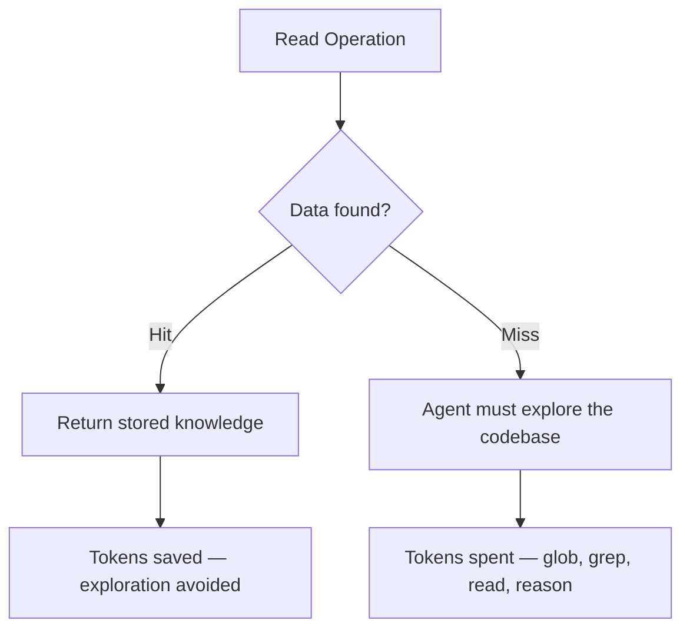
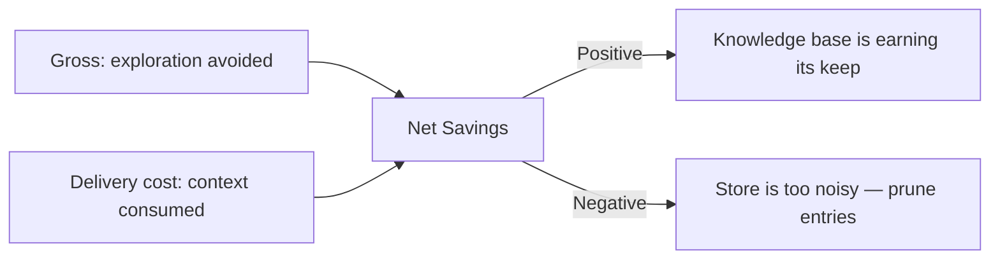
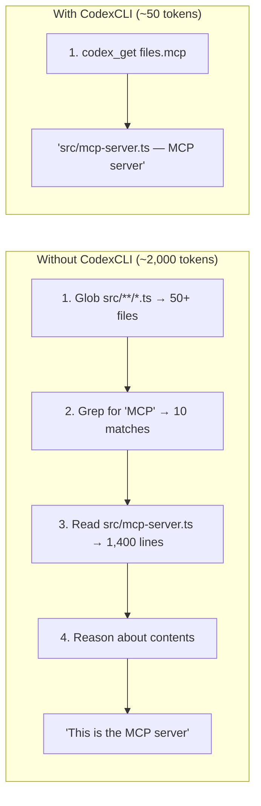
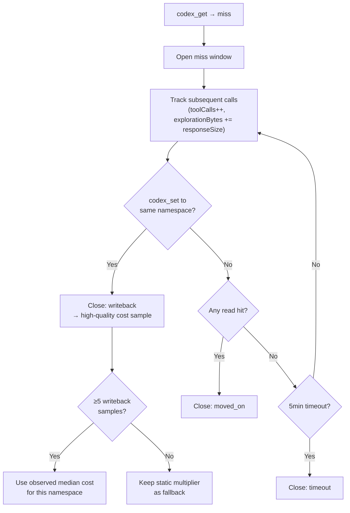
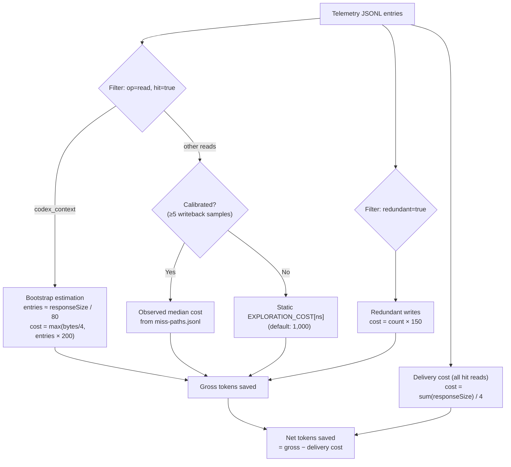
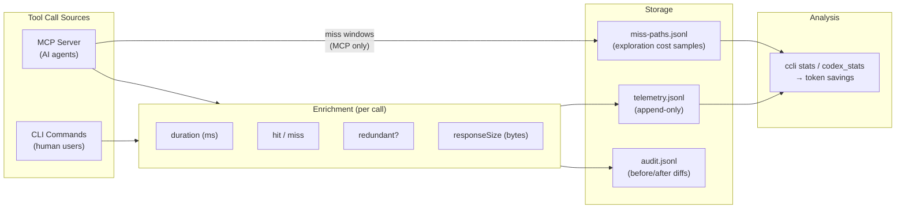

# Token Savings: How CodexCLI Measures AI Agent Efficiency

CodexCLI tracks how much work it saves AI agents by providing stored knowledge instead of forcing them to explore the codebase from scratch. This document explains every metric in `ccli stats`, how the estimates are calculated, why the methodology works, and where it falls short.

## Table of Contents

- [The Problem](#the-problem)
- [The Stats Output](#the-stats-output)
- [Metrics Reference](#metrics-reference)
  - [Lookup Hit Rate](#lookup-hit-rate)
  - [Duplicate Writes](#duplicate-writes)
  - [Data Served](#data-served)
  - [Avg Latency](#avg-latency)
  - [Est. Tokens Saved](#est-tokens-saved)
  - [Delivery Cost](#delivery-cost)
  - [Net Savings](#net-savings)
  - [By Namespace Breakdown](#by-namespace-breakdown)
  - [Duplicate Writes Avoided](#duplicate-writes-avoided)
- [How Exploration Cost Is Estimated](#how-exploration-cost-is-estimated)
  - [The Core Idea](#the-core-idea)
  - [Namespace Multipliers](#namespace-multipliers)
  - [Miss-Path Calibration](#miss-path-calibration)
  - [Bootstrap (codex_context) Estimation](#bootstrap-codex_context-estimation)
  - [Worked Example](#worked-example)
- [Data Collection](#data-collection)
  - [What Gets Logged](#what-gets-logged)
  - [How Hits and Misses Are Determined](#how-hits-and-misses-are-determined)
  - [How Redundant Writes Are Detected](#how-redundant-writes-are-detected)
- [Limitations and Shortcomings](#limitations-and-shortcomings)
- [Future Improvements](#future-improvements)

## The Problem

AI agents (Claude Code, Copilot, Cursor, ChatGPT, etc.) spend a significant portion of their token budget on **exploration** — reading files, searching codebases, and reasoning about what they find. Every session often repeats the same exploration: "Where is the MCP server?" "What's the build command?" "What conventions does this project follow?"

CodexCLI stores the answers to these questions. When an agent calls `codex_get files.mcp` and gets back `src/mcp-server.ts — MCP server, 20 tools, audit/telemetry wrapper`, that one call replaces what would have been 3-5 tool calls (glob for files, grep for patterns, read to confirm).

The question is: **how do we measure that value?**

## The Stats Output

Running `ccli stats` (or `codex_stats` via MCP) produces a token savings section:

```
Token savings:
  Lookup hit rate:   87% of reads found stored data (34 hits, 5 misses)
  Duplicate writes:  10% of writes were already up to date (6 of 58)
  Data served:       51.4KB returned from store, 585B avg
  Avg latency:       2ms per call
  Est. tokens saved: ~47.2K (exploration avoided by using stored knowledge)
    Delivery cost:   ~12.3K tokens (context delivered to agent)
    Net savings:     ~34.9K tokens
```

With `--detailed`, you also see the per-namespace breakdown with calibration tags:

```
    By namespace:
      bootstrap       ~20.0K (3 lookups x 6.7K each)
      arch            ~9.0K (3 lookups x 3.0K each) [observed, n=12]
      files           ~6.0K (3 lookups x 2.0K each) [static]
      context         ~6.0K (2 lookups x 3.0K each) [static]
      commands        ~2.0K (2 lookups x 1.0K each) [observed, n=8]
      project         ~1.5K (3 lookups x 500 each) [static]
    Duplicate writes avoided: ~900 (6 writes already up to date)
    Calibration: 2/6 namespaces observed, 4 static
```

Every number in this output is explained below.

## Metrics Reference

### Lookup Hit Rate

```
Lookup hit rate:   87% of reads found stored data (34 hits, 5 misses)
```

**What it measures:** The percentage of read operations (get, search, context, stale, export) that successfully returned stored data.

**How it's calculated:** `hits / (hits + misses) * 100`

**What counts as a hit:** A read where the response does not contain empty-result patterns like "not found", "no entries found", or "no entries stored".

**What counts as a miss:** A read that returned an error or empty result — the agent asked for something that wasn't stored.

**Why it matters:** A high hit rate means the knowledge base is well-populated for the agent's needs. A low hit rate means agents are asking for things that aren't stored yet — a signal to add more entries.



### Duplicate Writes

```
Duplicate writes:  10% of writes were already up to date (6 of 58)
```

**What it measures:** The percentage of write operations where the new value was identical to the existing value.

**How it's calculated:** A write is "duplicate" when the before and after values are the same string. Renames, dry runs, and import previews are excluded.

**Why it matters:** A moderate duplicate rate (5-15%) is normal — it means agents are confirming knowledge they already stored. A very high rate (>30%) might indicate agents aren't checking before writing, wasting calls.

### Data Served

```
Data served:       51.4KB returned from store, 585B avg
```

**What it measures:** The total bytes of text content returned across all tool calls, and the average per call.

**How it's calculated:** `Buffer.byteLength(responseText, 'utf8')` for each MCP tool response. This is the plain text the agent receives, not the JSON protocol envelope.

**Why it matters:** This is the raw throughput of the knowledge base. Higher numbers mean agents are consuming more stored knowledge per session.

### Avg Latency

```
Avg latency:       2ms per call
```

**What it measures:** The average wall-clock time to execute a tool call, from handler entry to response.

**Why it matters:** CodexCLI should be near-instant. If latency creeps up, it might indicate file locking contention or a very large data store.

### Est. Tokens Saved

```
Est. tokens saved: ~47.2K (agent tool calls avoided by using stored knowledge)
```

**What it measures:** The estimated total tokens that agents would have spent exploring the codebase if the stored knowledge didn't exist. This is the headline metric — the total value of the knowledge base.

**How it's calculated:** See [How Exploration Cost Is Estimated](#how-exploration-cost-is-estimated) below. This is the sum of exploration savings + duplicate write savings.

**Why it matters:** This is the return on investment for maintaining the knowledge base. Every token saved is a token the agent can spend on actual work instead of rediscovering what it already knew.

### Delivery Cost

```
Delivery cost:   ~12.3K tokens (context delivered to agent)
```

**What it measures:** The token cost of CodexCLI itself — the data it pushes into the agent's context window on cache hits. Every `codex_context` or `codex_get` hit returns data that consumes agent tokens.

**How it's calculated:** `sum(responseSize for all hit reads) / 4`

**Why it matters:** Token savings aren't free. If CodexCLI delivers 50KB of context but only saves the agent from 30KB of exploration, the net effect is negative. Delivery cost creates a natural pressure to keep the knowledge base lean and high-signal. Storing 500 low-value entries inflates delivery cost and erodes net savings.

### Net Savings

```
Net savings:     ~34.9K tokens
```

**What it measures:** The bottom line — exploration avoided minus delivery cost. This is the true value of the knowledge base.

**How it's calculated:** `estimatedTotalTokensSaved - deliveryCostTokens`

**Why it matters:** This is the number that matters for ROI. Gross exploration savings can look impressive, but if delivery cost is high, the knowledge base is consuming more tokens than it saves. Net savings can go negative — that's a signal to prune entries.



### By Namespace Breakdown

```
By namespace:
  bootstrap       ~20.0K (3 lookups x 6.7K tokens each)
  arch            ~9.0K (3 lookups x 3.0K tokens each)
  files           ~6.0K (3 lookups x 2.0K tokens each)
```

**What it measures:** The exploration savings broken down by namespace, showing how many lookups hit each namespace and the per-lookup cost used for estimation.

**Why it matters:** Tells you which namespaces are delivering the most value. If `files.*` dominates, the file map is the most valuable part of your knowledge base. If `bootstrap` dominates, agents are getting the most value from the initial `codex_context` call.

### Duplicate Writes Avoided

```
Duplicate writes avoided: ~900 (6 writes already up to date)
```

**What it measures:** Tokens saved because write operations didn't need to happen — the value was already current.

**How it's calculated:** `count_of_redundant_writes * 150`. The 150-token cost represents the approximate overhead of a wasted write call (the agent composing the value, making the call, processing the response).

## How Exploration Cost Is Estimated

### The Core Idea

When an agent calls `codex_get files.mcp` and gets an answer, it skips the exploration it would have done otherwise. We estimate the cost of that skipped exploration based on the **namespace** of the entry, because different types of knowledge require different amounts of work to discover.



The exploration estimate assigns a token cost to each namespace based on how many tool calls an agent would typically need to find that information from scratch.

### Namespace Multipliers

These multipliers are defined in `src/utils/telemetry.ts` as `EXPLORATION_COST`:

| Namespace | Tokens per Lookup | Rationale |
|-----------|-------------------|-----------|
| `files` | 2,000 | Agent would glob for files, grep for patterns, read to confirm (~3 tool calls) |
| `arch` | 3,000 | Understanding architecture requires reading multiple files, tracing patterns, reasoning about structure (~5 tool calls) |
| `context` | 3,000 | Gotchas and edge cases require deep investigation, often discovered through trial and error (~5 tool calls) |
| `conventions` | 1,500 | Requires reading several files to notice patterns, comparing styles (~3 tool calls) |
| `commands` | 1,000 | Agent would grep for build/test scripts, read package.json or Makefile (~2 tool calls) |
| `deps` | 800 | Reading package.json plus maybe documentation (~2 tool calls) |
| `project` | 500 | Reading README or package.json (~1 tool call) |
| *(default)* | 1,000 | Conservative fallback for unknown or custom namespaces |

**How these numbers were derived:** Each multiplier estimates the tokens consumed by the tool calls an agent would make, including:
- **Tool call overhead:** Each tool call costs ~100-200 tokens for the request
- **Response content:** File reads return 500-2000 tokens of content
- **Reasoning tokens:** The agent spends tokens processing and synthesizing results

The values are intentionally conservative. A real `arch.*` lookup might save 5,000+ tokens if the agent would have read 3-4 files and reasoned about the architecture. We estimate 3,000.

### Miss-Path Calibration

The static multipliers above are educated guesses. CodexCLI replaces them with **observed costs** as it collects real data from cache misses.

**How it works:** When a `codex_get` or `codex_search` misses (returns no data), CodexCLI opens a "miss window" for that session and namespace. It tracks subsequent tool calls — the exploration the agent does to find the answer — until one of three things happens:

| Resolution | Trigger | Meaning |
|------------|---------|---------|
| **writeback** | Agent calls `codex_set` to the same namespace | Agent found the answer and stored it — clean signal |
| **moved_on** | Agent gets a hit on any key | Agent found what it needed elsewhere |
| **timeout** | 5 minutes elapse with no resolution | Agent abandoned the search or session ended |

The exploration cost for each closed miss window is `sum(responseSize of all calls in the window) / 4` — the tokens the agent actually consumed while searching.

**Calibration threshold:** Once a namespace accumulates **5 or more writeback resolutions**, CodexCLI switches from the static multiplier to the **median observed cost** for that namespace. The `[observed, n=12]` tag in the stats output indicates this.



**Why only writebacks?** A `writeback` resolution means the agent completed a full miss→explore→find→store cycle. That's a clean measurement of exploration cost. `moved_on` and `timeout` are noisy — the agent may have partially explored or given up — and are excluded from calibration.

Miss-path records are stored in `~/.codexcli/miss-paths.jsonl` and can be cleared with `ccli reset miss-paths` or `codex_reset type:"miss-paths"`.

### Bootstrap (codex_context) Estimation

The `codex_context` tool is special — it returns many entries at once in a single call. Its exploration cost is calculated differently:

```
approx_entries  = response_size_bytes / 80     (each entry averages ~80 bytes)
exploration_cost = max(
  response_size / 4,                           (delivery floor)
  approx_entries * 200                         (200 tokens per entry avoided)
)
```

The 200-token-per-entry cost reflects that each entry in the context represents roughly one small lookup the agent would have needed to make. The `max()` ensures the exploration estimate is never lower than the delivery floor.

**Example:** A `codex_context` call returns 8,000 bytes (~100 entries):
- Delivery floor: `8000 / 4 = 2,000 tokens`
- Exploration estimate: `100 entries * 200 = 20,000 tokens`
- Result: `max(2000, 20000) = 20,000 tokens`

### Estimation Pipeline



### Worked Example

A typical session might look like this:

| Call | Tool | Namespace | Response | Hit? | Exploration Savings |
|------|------|-----------|----------|------|-------------------|
| 1 | `codex_context` | (bootstrap) | 8,000B | Yes | 20,000 |
| 2 | `codex_get` | files | 200B | Yes | 2,000 |
| 3 | `codex_get` | arch | 300B | Yes | 3,000 |
| 4 | `codex_get` | missing.key | 30B | No | 0 |
| 5 | `codex_set` | context | — | — | 0 |
| 6 | `codex_set` | context | — | Redundant | 150 |

**Totals:**
- Gross exploration avoided: `20,000 + 2,000 + 3,000 + 150 = 25,150 tokens`
- Delivery cost: `(8000 + 200 + 300) / 4 = 2,125 tokens`
- **Net savings: 25,150 − 2,125 = 23,025 tokens**

The gross estimate is **12x** the delivery cost in this example, reflecting the leverage of stored knowledge. As the knowledge base grows, both numbers increase — but if entries become low-signal, delivery cost grows faster than exploration savings, and net savings shrinks.

## Data Collection



### What Gets Logged

Every tool call is logged to `~/.codexcli/telemetry.jsonl` as a single JSON line:

```json
{
  "ts": 1712438400000,
  "tool": "codex_get",
  "session": "a1b2c3d4",
  "op": "read",
  "ns": "files",
  "src": "mcp",
  "scope": "project",
  "project": "/path/to/repo",
  "duration": 2,
  "hit": true,
  "redundant": null,
  "responseSize": 200,
  "agent": "claude-code"
}
```

| Field | Description |
|-------|-------------|
| `ts` | Unix timestamp (ms) |
| `tool` | MCP tool name (e.g., `codex_get`, `codex_context`) |
| `session` | Random ID per MCP server process |
| `op` | Operation type: `read`, `write`, `exec`, or `meta` |
| `ns` | Top-level namespace extracted from the key (e.g., `arch` from `arch.mcp`) |
| `src` | Source: `mcp` or `cli` |
| `scope` | Data scope: `project` or `global` |
| `project` | Absolute path to the project directory |
| `duration` | Execution time in milliseconds |
| `hit` | Whether the read returned stored data (reads only) |
| `redundant` | Whether the write was a no-op (writes only) |
| `responseSize` | UTF-8 byte length of the response text |
| `agent` | Value of `CODEX_AGENT_NAME` env var (if set) |

### How Hits and Misses Are Determined

**MCP:** A read is a "miss" if the response text contains any of these patterns (case-insensitive):

- `"not found"`
- `"no entries found"`
- `"no entries stored"`
- `"no results found"`
- `"no aliases defined"`
- `"no audit entries"`

Everything else is a "hit". This is intentionally generous — a response that returns even partial data counts as a hit.

**CLI:** A read is a "hit" if the process exit code stays at 0 (no error).

### How Redundant Writes Are Detected

A write is "redundant" when:
1. The entry already existed (has a "before" value)
2. The new value equals the old value (string comparison)
3. The operation is not a rename, dry run, or preview

## Limitations and Shortcomings

### The static multipliers are educated guesses (but self-calibrating)

The static namespace multipliers (e.g., `files: 2000`, `arch: 3000`) are based on reasonable estimates of typical agent behavior, not empirical measurement. Different agents, codebases, and tasks would produce different actual exploration costs.

**Impact:** The exploration estimate could over- or under-count by 2-3x for any individual lookup. However, as miss-path data accumulates (≥5 writeback samples per namespace), the static multipliers are replaced with observed medians. The `[observed, n=N]` vs `[static]` tags in `--detailed` output show which namespaces have been calibrated.

### No per-entry granularity

All `files.*` lookups get the same 2,000-token multiplier, whether the entry is `files.entry` (a one-liner about the CLI entry point) or a hypothetical `files.architecture` (a long description that would take extensive exploration to discover). In reality, some entries save more exploration than others.

### Bootstrap entry count is approximated

The `codex_context` estimation divides `responseSize` by 80 to approximate entry count. This works reasonably well for typical entries (~80 bytes of formatted output per line), but breaks down for entries with very long or very short values.

### CLI reads don't log responseSize

CLI tool calls (as opposed to MCP) don't always log `responseSize`, so CLI-only usage may have incomplete data for the delivery floor calculation. The exploration estimate is unaffected since it uses hit counts, not response sizes.

### No A/B comparison

The gold standard would be measuring actual token usage in sessions with and without CodexCLI. The current approach estimates the counterfactual ("what would the agent have done?") rather than measuring it directly.

### Misses aren't penalized

When an agent calls `codex_get` and gets a miss, it still spent tokens on the call. These "wasted" lookup tokens aren't subtracted from the savings estimate. In practice, misses are rare (typically <15% of reads) and cheap (~50 tokens each), so the impact is small.

### Multi-entry responses use a single namespace

When `codex_get arch` returns a subtree with 13 entries, the entire response is counted as one hit against the `arch` namespace. The exploration cost for discovering all 13 entries individually would be higher than one `arch` multiplier.

## Future Improvements

- **Per-entry cost modeling:** Use `responseSize` or value length to weight individual entries differently within a namespace.
- **Agent-specific multipliers:** Different agents (Claude Code, Copilot, Cursor) have different exploration patterns and token costs. Per-agent calibration using miss-path data could improve accuracy.
- **Cross-session deduplication:** Track when the same entry is read across multiple sessions to measure cumulative value over time.
- **Configurable multipliers:** Allow users to override `EXPLORATION_COST` values for their specific workflows.
- **Miss-path query tool:** Expose miss-path records via `codex_miss_paths` MCP tool for agents to inspect exploration cost data directly.
